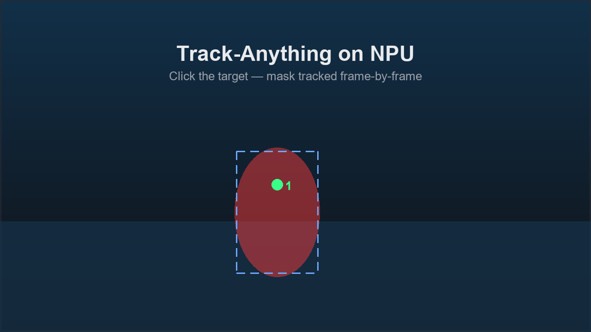

# QAI AppBuilder — Community Apps 🌍

On-device AI apps built by **the community**, powered by the Qualcomm NPU via
[QAI AppBuilder](https://github.com/quic/ai-engine-direct-helper).

> This is the community showcase. Qualcomm-curated official apps live in
> [`../samples/apps/`](../samples/apps/). Anyone can add an app here — see
> [Submit your app](#-submit-your-app) below.

> 💬 **Just want to show it off?** Post in
> [Discussions → Show & Tell](https://github.com/qualcomm/qai-appbuilder/discussions/categories/show-and-tell)
> or open an [Issue](https://github.com/qualcomm/qai-appbuilder/issues) —
> lower barrier than a PR and the fastest way to get noticed. Ready to be listed
> here? Follow the submission steps.

## 🖼️ Gallery

The app wall below is **auto-generated** from each app's `app.json` and renders
directly here on GitHub — no build step needed to browse it.

<!-- GALLERY:START -->
<table>
  <tr>
    <td align="center" valign="top" width="33%"><a href="genie-notes/"></a><br><a href="genie-notes/"><b>Genie Notes</b></a><br><sub><code>genai</code> · by <a href="https://github.com/qualcomm">@qualcomm</a></sub><br><sub>Summarize and tidy your meeting notes on-device with a local Genie LLM — private, offline, one command.</sub></td>
    <td align="center" valign="top" width="33%"><a href="track-anything/"></a><br><a href="track-anything/"><b>Track-Anything</b></a><br><sub><code>vision</code> · by <a href="https://github.com/tim202503">@tim202503</a></sub><br><sub>Click a target in any video and track it frame-by-frame with XMem segmentation, running fully on the Snapdragon NPU.</sub></td>
  </tr>
</table>
<!-- GALLERY:END -->

> The interactive version ([`index.html`](index.html), with category filters and
> a contributor wall) is a single-page app that reads `apps.json` at runtime.
> **GitHub does not execute it** in the file browser, so view it one of these ways:
>
> - **Locally**: `cd CommunityApps && python -m http.server 8000` → open
>   <http://localhost:8000/index.html> (opening `index.html` via `file://`
>   directly won't work — the browser blocks the `fetch('apps.json')`).
> - **GitHub Pages**: enable Pages for the repo, then browse to
>   `https://<owner>.github.io/<repo>/CommunityApps/index.html`.
> - **Quick online preview** (no Pages setup): open it through
>   [htmlpreview.github.io](https://htmlpreview.github.io/) — paste the
>   `index.html` GitHub URL.

## 📇 App index

> This table is generated from each app's `app.json` by `build_gallery.py`.
> **Do not edit it by hand** — edit the app's `app.json` and rerun the script.

<!-- APPS_TABLE:START -->
| App | Category | Author | Description |
|-----|----------|--------|-------------|
| [Genie Notes](genie-notes/) | genai | [@qualcomm](https://github.com/qualcomm) | Summarize and tidy your meeting notes on-device with a local Genie LLM — private, offline, one command. |
| [Track-Anything](track-anything/) | vision | [@tim202503](https://github.com/tim202503) | Click a target in any video and track it frame-by-frame with XMem segmentation, running fully on the Snapdragon NPU. |
<!-- APPS_TABLE:END -->

## 🙌 Contributors

<!-- CONTRIBUTORS:START -->
[@qualcomm](https://github.com/qualcomm), [@tim202503](https://github.com/tim202503)
<!-- CONTRIBUTORS:END -->

## 🚀 Submit your app

`app.json` is the key — it makes your app **auto-discoverable**. The gallery page,
the index table above, the contributor wall, and CI validation are all driven by
it. You never hand-maintain a list.

1. **Fork** the repo (or work on your fork, e.g.
   [tim202503/ai-engine-direct-helper](https://github.com/tim202503/ai-engine-direct-helper)).
2. **Copy the template**: duplicate [`_template/`](_template/) to
   `CommunityApps/<your-slug>/`.
3. **Fill in [`app.json`](_template/app.json)** — the single source of truth. Keep
   `slug` equal to your folder name. Add a 16:9 screenshot under `assets/`.
4. **Make it run** with the `run.command` you declared (default `python main.py`).
   Do **not** commit model weights — list `models[].source` only (ideally your
   app auto-downloads them on first run).
5. **Regenerate & verify** locally:
   ```bash
   python build_gallery.py --date <today>   # writes apps.json + the table above
   python build_gallery.py --check          # must pass (this is what CI runs)
   ```
   Open `index.html` and confirm your card shows up.
6. **Open a PR.** CI validates your `app.json` against
   [`schema/app.schema.json`](schema/app.schema.json) and checks the gallery is
   up to date. A maintainer reviews per the
   [community standards](../docs/community.md).

New here? Look for issues labelled **`good first app`**.

## 📂 Layout

```
CommunityApps/
├── index.html          # visual gallery (reads apps.json)
├── apps.json           # generated manifest — do not hand-edit
├── build_gallery.py    # auto-discovers apps, regenerates apps.json + tables
├── schema/app.schema.json
├── _template/          # copy this to start a new app
├── track-anything/     # community app
└── genie-notes/        # community app (minimal Genie example)
```

See also: [../docs/community.md](../docs/community.md) — full submission guide,
review criteria, and the Awesome list.
