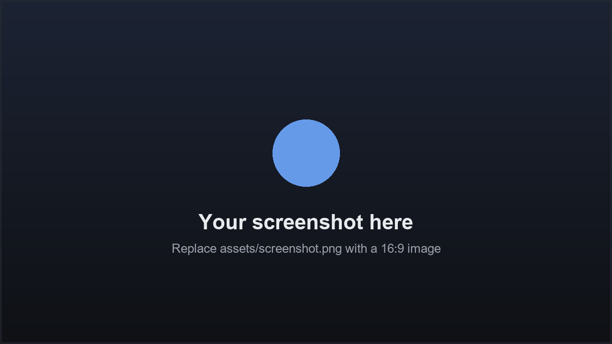

# {Your App Name}

> One-line pitch. Replace everything in this template, then delete these hints.



## What it does
A short paragraph describing the app, the user problem it solves, and how it
runs on the Qualcomm NPU through [QAI AppBuilder](https://github.com/quic/ai-engine-direct-helper).

## Models
| Model | Runtime | Precision | Source |
|-------|---------|-----------|--------|
| your-model-name | QNN | int8 | https://aihub.qualcomm.com/ |

> Do **not** commit model weights. List the download source only; users and
> reviewers fetch them on demand (ideally your `main.py` auto-downloads on first run).

## Requirements
- OS: Windows on ARM64 (Snapdragon X Elite / X Plus)
- Python >= 3.10
- qai_appbuilder >= 2.24.0
- 16 GB RAM recommended

## Run
```bash
pip install -r requirements.txt
python main.py
```

On Windows you can also just double-click [`start.bat`](start.bat).

## Notes
- Fill in [`app.json`](app.json) — it is the **single source of truth**. The
  gallery ([`../index.html`](../index.html)) and the index table
  ([`../README.md`](../README.md)) are auto-generated from it by
  `../build_gallery.py`. Do not hand-edit those.
- Keep `slug` in `app.json` equal to this folder's name.
- Contribution standards & review criteria:
  [../../docs/community.md](../../docs/community.md)
