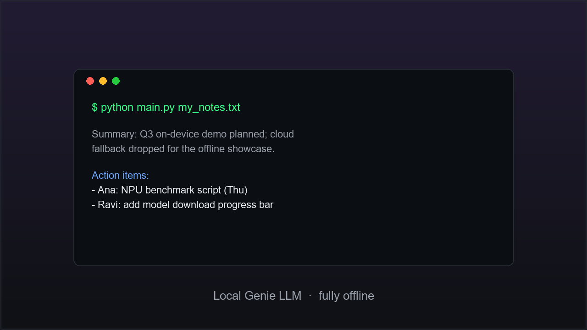

# Genie Notes

> Summarize and tidy your notes on-device with a local Genie LLM — private, offline.



## What it does
Genie Notes is a tiny command-line app that reads a plain-text note, sends it to
a **locally running Genie LLM** (via the OpenAI-compatible `GenieAPIService`), and
prints a clean summary plus an action-item list. It is a minimal reference for the
QAI AppBuilder Genie chat-completions flow, and a good copy-me starting point for
your own text app. Your notes never leave the device.

## Models
| Model | Runtime | Precision | Source |
|-------|---------|-----------|--------|
| llama-3.2-3b-instruct | QNN | int4 | https://aihub.qualcomm.com/ |

> Any LLM loaded by your `GenieAPIService` works — change `MODEL` in `main.py`.
> No weights are committed here.

## Requirements
- OS: Windows on ARM64 (Snapdragon X Elite / X Plus)
- Python >= 3.10
- qai_appbuilder >= 2.24.0
- A running **GenieAPIService** (listens on port 8910 by default) — see
  [`samples/genie/python/GenieAPIService.py`](../../samples/genie/python/GenieAPIService.py)
- 16 GB RAM recommended

## Run
1. Start the Genie service (in another terminal):
   ```bash
   python ../../samples/genie/python/GenieAPIService.py
   ```
2. Run the app:
   ```bash
   pip install -r requirements.txt
   python main.py                 # uses a built-in sample note
   python main.py my_notes.txt    # or your own file
   ```

On Windows you can also double-click [`start.bat`](start.bat).

## Notes
- Uses only the Python standard library for the HTTP call (`urllib`), so
  `requirements.txt` is minimal.
- `app.json` is the single source of truth for the gallery — see
  [../README.md](../README.md).
- Contribution standards: [../../docs/community.md](../../docs/community.md).
